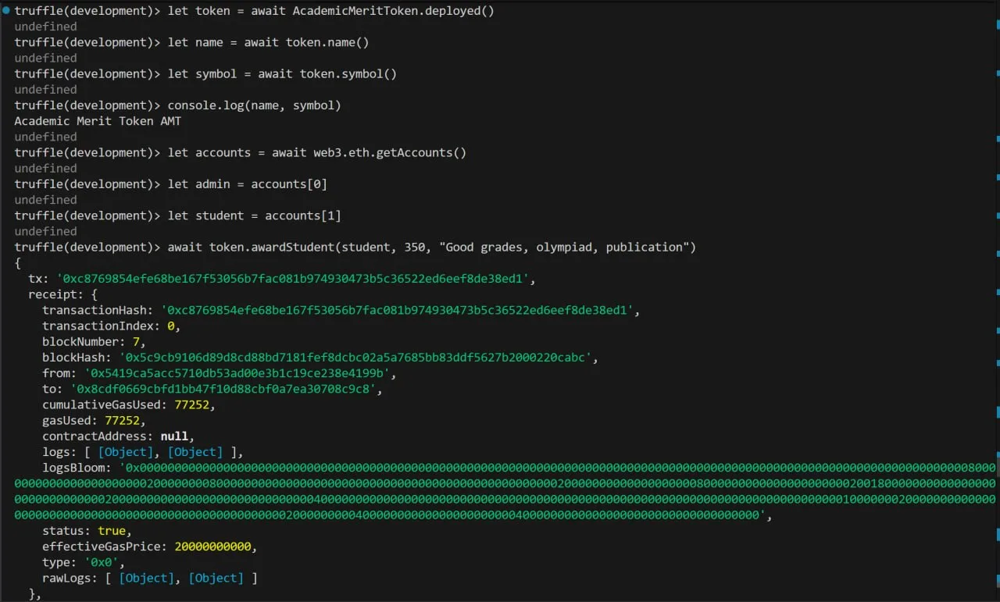
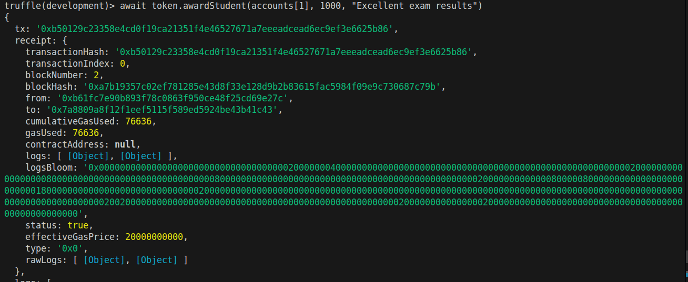
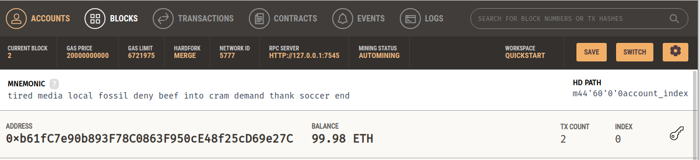
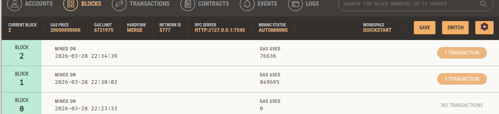
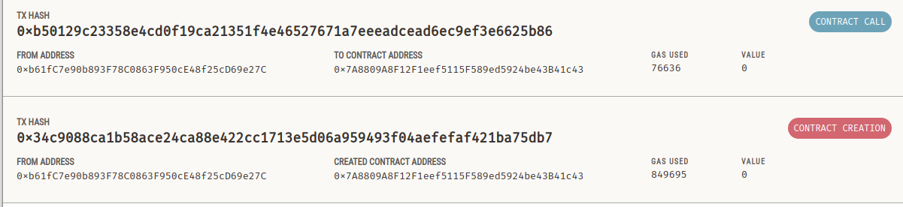

# Academic Merit Token (AMT)

## 📋 Оглавление

| # | Раздел | |
|---|--------|-------|
| 1 | [Общая информация](#1-общая-информация) | |
| 2 | [Требования к системе](#2-требования-к-системе) | |
| 3 | [Установка и настройка окружения](#3-установка-и-настройка-окружения) | 1. [Установка Ganache](#31-установка-ganache)<br>2. [Настройка VSCode](#32-настройка-visual-studio-code-для-solidity)<br>3. [Установка Node.js](#33-установка-nodejs)<br>4. [Установка Truffle](#34-установка-truffle) ||
| 4 | [Смарт-контракт AMT](#4-смарт-контракт-amt) | 1. [ Выбор стандарта (ERC-20)](#41-выбор-стандарта-erc-20)<br>2. [Описание логики работы](#42-описание-логики-работы)<br>3. [Основные функции контракта](#43-основные-функции-контракта) |
| 5 | [Интеграция персонального токена](#5-интеграция-персонального-токена) | 1. [Замена ether на AMT](#51-замена-ether-на-amt)<br>2. [Использование токена в приложениях](#52-использование-токена-в-приложениях) ||
| 6 | [Сборка и деплой](#6-сборка-и-деплой) | 1. [Команды для компиляции](#61-команды-для-компиляции)<br>2. [Конфигурация Truffle](#62-конфигурация-truffle)<br>3. [Публикация в локальный блокчейн (Ganache)](#63-публикация-в-локальный-блокчейн-ganache) |
| 7 | [Взаимодействие с контрактом](#7-взаимодействие-с-контрактом) | 1. [Вызов методов](#71-вызов-методов)<br>2. [Примеры транзакций](#72-примеры-транзакций) ||
| 8 | [Сравнение стандартов ERC](#8-сравнение-стандартов-erc) | 1. [ERC-20](#81-erc-20)<br>2. [ERC-721](#82-erc-721)<br>3. [ERC-777](#83-erc-777)<br>4. [Сравнительная таблица](#84-сравнительная-таблица)<br>5. [Почему выбран ERC-20](#85-почему-выбран-erc-20)<br>6. [Источники](#источники) ||
| 9 | [Полезность токена (Business Value)](#9-полезность-токена-business-value) |  1. [Для студентов](#91-для-студентов)<br>2. [Для университета](#92-для-университета) ||
| 10 | [Команда проекта](#10-команда-проекта) | |

---

## Структура репозитория

```text
smart_contract_misis/
├── build/
│   └── contracts/                        # Скомпилированные артефакты контрактов
│       └── AcademicMeritToken.json       # JSON-конфигурация (артефакт) академического токена
├── contracts/                            # Исходные файлы смарт-контрактов
│   └── AMToken.sol                       # Основной смарт-контракт академического токена
├── img/                                  # Изображения проекта
│   ├── 1.png
│   ├── 2.png
│   ├── 3.png
│   ├── award.png
│   └── call.png
├── migrations/                     # Скрипты деплоя смарт-контракта с использованием Truffle
│   ├── 2_deploy_amt.js             # Деплой основного смарт-контракта          
├── LICENSE                         # Лицензия проекта
├── README.md                       # Документация и инструкции
├── package-lock.json               # Точная фиксация версий зависимостей проекта
├── package.json                    # Основной файл управления зависимостями
└── truffle-config.js               # Конфигурация Truffle для разработки и деплоя
```

---

## 1. Общая информация

Смартконтракт реализует систему поощрений студентов за академические достижения.

Токены начисляются за различные достижения:
1. публикация статей
2. закрытие сессии без троек
3. участие в различных мероприятиях и тд.

Токены могут быть обменяны на различные привилегии (например, мерч).

---

## 2. Требования к системе

1. openzeppelin/contracts >= 5.6.1
2. solidity == 0.8.20
3. nodejs == 18.20.8
4. ganache
5. truffle

---

## 3. Установка и настройка окружения

### 3.1. Установка Ganache

Ganache можно установить с официального сайта [ganache](https://archive.trufflesuite.com/ganache/).

Для систем Linux скачанному файлу необходимо добавить права на выполнение.

### 3.2. Настройка Visual Studio Code для Solidity

Расширение Solidity можно скачать в официальном репозитории расширений.

### 3.3. Установка NodeJS

NodeJS можно установить с официального сайта [nodejs](https://nodejs.org/en/download).

### 3.4. Установка Truffle

Truffle ставится через пакетный менеджер npm командой:

`
npm install -g truffle
`

---

## 4. Смарт-контракт AMT

### 4.1. Выбор стандарта (ERC-20)

Для реализации сматрконтракта был выбран стандарт ERC-20.

### 4.2. Описание логики работы

1. **Инициализация:** при создании контракта администратор (`admin`) назначается адрес создателя.
2. **Хранение данных:**
   - `balanceOf` — балансы пользователей;
   - `allowance` — разрешения на расход токенов от имени владельца.
3. **Начисление токенов:** функция `awardStudent` (только для администратора) начисляет токены студенту с указанием причины (`reason`), увеличивает `totalSupply` и эмитирует события `Transfer` и `Awarded`.
4. **Обмен токенов на привилегии:** функция `redeem` позволяет пользователю «сжечь» токены (обменять на привилегии), уменьшает баланс пользователя и `totalSupply`, эмитирует события `Transfer` (на `address(0)`) и `Redeemed`.
5. **Получение баланса:** функция `getBalance` возвращает баланс студента в удобочитаемом формате (без wei, делит на `10**decimals`).
6. **Контроль доступа:** модификатор `onlyAdmin` разрешает выполнение определённых функций только администратору.
7. **События:** отслеживают все ключевые операции (`Transfer`, `Approval`, `Awarded`, `Redeemed`) для аудита и интеграции с фронтендом.


### 4.3. Основные функции контракта

Стандартные методы ERC-20 описаны в разделе 9.1

Помимо стандартных методов были добавлены специфические для контракта методы:
- `awardStudent` - начисление токенов
- `redeem` - обмен токенов на привилегии
- `getBalance` - получение отформатированного баланса

---

## 5. Интеграция персонального токена

### 5.1. Замена ether на AMT
Необходимо:
1. использовать конвертацию `value * 10**decimals` при начислении и обмене
2. прием платежей вести через `transferFrom()`
3. обмен через `redeem`
4. хранение AMT в `mapping balanceOf`

### 5.2. Использование токена в приложениях

Пример вызова функции токена через truffle:



---

## 6. Сборка и деплой

### 6.1. Команды для компиляции

1. `truffle init` - для инициализации проекта
2. `truffle compile` - для компиляции проекта
3. `truffle migrate` - загрузка в ganache (должен быть запущен ganache и конфиге truffle указан сетевой адрес)

### 6.2. Конфигурация Truffle

Стандартный конфиг truffle для локального деплоя контрактов:

```
module.exports = {
  networks: {
    development: {
      host: "127.0.0.1", # адрес ganache
      port: 7545, # порт ganache
      network_id: "*",
      gas: 12000000, # необходимо также настроить max gas ganache
      gasPrice: 20000000000,
    },
  },
compilers: {
  solc: {
    version: "0.8.20",
    settings: {
      optimizer: {
        enabled: true,
        runs: 200
      },
      evmVersion: "paris" 
    }
  }
}
};
```

### 6.3. Публикация в локальный блокчейн (Ganache)

Выполняется с помощью команды `truffle migrate`

---

## 7. Взаимодействие с контрактом

### 7.1. Вызов методов



На скриншоте продемонстрировано начисление 1000 токенов студенту через вызов метода `awardStudent`.

### 7.2. Примеры транзакций

На следующих скриншотах показано, как результаты работы смарт-контракта отображаются в Ganache: во вкладках Accounts и Blocks видны выполненные операции, а во вкладке Transactions - транзакции создания контракта и последующего вызова его метода.







---

## 8. Сравнение стандартов ERC

### 8.1. ERC-20

**Определение:** технический стандарт для взаимозаменяемых (fungible) токенов на Ethereum, предложенный в 2015 году.

**Ключевые особенности:**
- **Взаимозаменяемость:** каждый токен идентичен по ценности и функциям, идеально подходит для валют и utility-токенов
- **Делимость:** токены можно делить на мелкие части (количество знаков после запятой задаётся создателем)
- **Совместимость:** широко поддерживается кошельками, биржами и децентрализованными приложениями (dApps)

**Основные функции:**
- `totalSupply()` — общее количество токенов
- `balanceOf(address)` — баланс адреса
- `transfer(recipient, amount)` — перевод токенов
- `allowance(owner, spender)` — лимит на снятие средств
- `approve(spender, amount)` — разрешение на снятие средств
- `transferFrom(sender, recipient, amount)` — перевод с использованием механизма allowance

**Примеры проектов:** Tether (USDT), Chainlink (LINK), USD Coin (USDC)

---

### 8.2. ERC-721

**Определение:** стандарт для невзаимозаменяемых токенов (NFT), предложенный в 2018 году.

**Ключевые особенности:**
- **Уникальность:** каждый токен имеет уникальный идентификатор `tokenId` и не может быть заменён другим токеном один к одному
- **Неделимость:** токен нельзя разделить на части, он существует как единое целое
- **Метаданные:** поддерживает хранение дополнительной информации (имя, описание, URL изображения) через `tokenURI`

**Основные функции:**
- `balanceOf(address)` — количество NFT на адресе
- `ownerOf(tokenId)` — владелец конкретного токена
- `approve(to, tokenId)` — разрешение на управление токеном
- `transferFrom(from, to, tokenId)` — передача токена
- `safeTransferFrom(from, to, tokenId)` — безопасная передача с проверкой получателя

**Примеры проектов:** CryptoKitties, Bored Ape Yacht Club (BAYC), виртуальная земля в Decentraland

---

### 8.3. ERC-777

**Определение:** усовершенствованный стандарт взаимозаменяемых токенов, обратно совместимый с ERC-20.

**Ключевые особенности:**
- **Хуки (hooks):** позволяет контрактам-получателям автоматически реагировать на получение токенов через функцию `tokensReceived`
- **Одна транзакция:** вместо двух транзакций (`approve` + `transferFrom`) используется одна с оператором
- **Отмена транзакций:** автоматически отклоняет отправку на несовместимые контракты
- **Операторы:** возможность назначать адреса, которые могут отправлять токены от имени владельца
- **Черные списки:** возможность помечать неблагонадёжные адреса

**Особенность:** более сложный и газозатратный по сравнению с ERC-20

---

### 8.4. Сравнительная таблица

| Характеристика | ERC-20 | ERC-721 | ERC-777 |
|----------------|--------|---------|--------|
| **Тип токена** | взаимозаменяемый (fungible) | невзаимозаменяемый (non‑fungible) | взаимозаменяемый |
| **Уникальность** | все токены одинаковы | каждый токен уникален (`tokenId`) | все токены одинаковы |
| **Делимость** | да (задаётся decimals) | нет (неделим) | да |
| **Газовые затраты** | низкие | средние | выше, чем у ERC-20 |
| **Совместимость** | высокая (все кошельки и биржи) | высокая (NFT-маркетплейсы) | средняя |
| **Хуки (hooks)** | нет | нет | да (`tokensReceived`) |
| **Операторы** | да (`approve`/`allowance`) | да (`setApprovalForAll`) | да (расширенные) |
| **Основное применение** | криптовалюты, utility-токены, стейблкоины | цифровое искусство, коллекционные предметы, игровые активы | усовершенствованные DeFi-токены |

---

### 8.5. Почему выбран ERC-20

Для проекта **Academic Merit Token (AMT)** был выбран стандарт **ERC-20** по следующим причинам:

1. **Взаимозаменяемость токенов:** AMT представляет собой накопительные баллы, которые одинаковы для всех студентов. Нет необходимости создавать уникальные токены для каждого достижения.

2. **Простота рейтинга:** публичный рейтинг топ-10 студентов строится на основе баланса токенов, что легко реализуется через функцию `balanceOf`.

3. **Экономия газа:** начисление токенов планируется производить для большого количества студентов. ERC-20 требует меньше газа на транзакцию по сравнению с ERC-777 и не требует создания уникальных идентификаторов как ERC-721.

4. **Широкая совместимость:** ERC-20 поддерживается всеми кошельками (MetaMask, Trust Wallet) и инструментами разработки (Truffle, Hardhat), что упрощает интеграцию с университетской системой.

5. **Соответствие цели:** ERC-20 идеально подходит для utility-токенов, которые используются внутри экосистемы для доступа к сервисам (обмен на привилегии).

6. **Простота реализации:** базовый функционал ERC-20 легко расширяется с помощью OpenZeppelin для добавления ролей (`AccessControl`), сжигания токенов (`Burnable`) и приостановки операций (`Pausable`), что полностью покрывает требования технического задания.

---

### Источники
- [GeeksforGeeks: ERC20 vs ERC721 in Ethereum](https://www.geeksforgeeks.org/ethical-hacking/erc20-vs-erc721-in-ethereum/)
- [Habr: Разбираемся с форматами токенов на Ethereum](https://habr.com/ru/articles/512476/)

---

## 9. Полезность токена (Business Value)

Academic Merit Token (AMT) представляет собой внутренний цифровой токен университета, предназначенный для поощрения студентов за академические, научные и внеучебные достижения. В рамках проекта токены начисляются за полезную активность, а затем могут использоваться внутри университетской экосистемы как средство обмена на определенные привилегии. Такая модель делает систему мотивации более современной, прозрачной и технологичной.

### 9.1. Для студентов

Для студентов AMT является понятным механизмом признания их достижений. В отличие от традиционных форм поощрения, которые часто ограничиваются грамотой, благодарностью или начислением баллов в рамках внутренних рейтингов и систем наподобие ПГАС, токен создает цифровую и накапливаемую форму награды. Студент может видеть результат своей активности в виде конкретного баланса токенов, который отражает его вклад в учебную, научную и общественную жизнь университета, и получать за достижения не только формальное признание, но и реальную прикладную пользу.

Практическая ценность токена для студентов заключается в том, что он повышает мотивацию к участию в мероприятиях, публикационной деятельности, хорошей учебе и другим полезным инициативам. Кроме того, токен может обмениваться на внутренние привилегии, например университетский мерч, бонусы, доступ к отдельным возможностям или участие в специальных программах. За счет этого AMT становится не просто формальной единицей учета, а инструментом, который связывает достижения студента с реальной пользой.

Таким образом, для студентов Academic Merit Token выступает одновременно как средство мотивации, способ цифровой фиксации заслуг и элемент более современной образовательной среды, в которой достижения можно не только учитывать, но и практически использовать внутри экосистемы университета.

### 9.2. Для университета

Для университета AMT является инструментом цифровизации системы поощрения и внутренней мотивации студентов. Вместо разрозненного учета достижений можно использовать единый смарт-контракт, в котором начисление наград выполняется по прозрачным правилам, а история операций фиксируется в блокчейне. Это делает систему более понятной, контролируемой и удобной для дальнейшего развития.

С организационной точки зрения токен помогает повысить вовлеченность студентов в учебную, научную и общественную деятельность. Университет получает возможность стимулировать полезное поведение не только административными методами, но и через цифровую систему вознаграждений. Рост такой активности выгоден и самому вузу, поскольку способствует развитию научной среды, увеличению числа публикаций и участий в значимых мероприятиях, а также укреплению репутации и конкурентных позиций университета. Дополнительно такой подход может снизить долю ручного учета и упростить контроль за начислением и использованием внутренних поощрений.

Также AMT формирует для университета имидж современной образовательной организации, которая использует технологии блокчейна не только в учебных целях, но и как прикладной инструмент для управления мотивацией и активностью студентов. В перспективе такой токен может стать основой для развития дополнительных сервисов: рейтингов, программ лояльности, внутренних бонусных систем и интеграции с другими цифровыми платформами университета.

---

## 10. Команда проекта
### Студенты группы МПИ-25-1:
Шевченко Г.В.
Комарова Д.А.
Васильчиков А.В. 
Алькина А.Р.
Харлашкина А.В.

---
